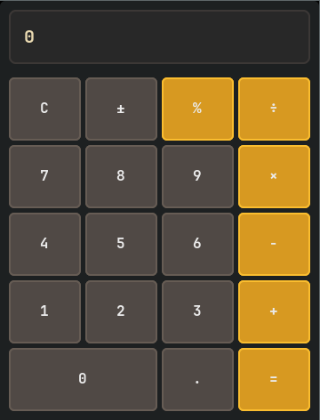

<p align="center">
  
</p>

<h1 align="center">Calculatorrr</h1>

<p align="center">
  <b> Simple GTK Calculator </b>
</p>

<p align="center">
  
  
  
  
  
</p>

## Compilation instructions:

```bash
g++ -o calculatorrr calculatorrr.cpp `pkg-config --cflags --libs gtk4`
```
 
### Make sure to have GTK4 development libraries installed:
- Ubuntu/Debian:
  ```bash
  sudo apt install libgtk-4-dev
  ```
- Fedora:
  ```bash
  sudo dnf install gtk4-devel
  ```
- Arch:
  ```bash
  sudo pacman -S gtk4
  ```
